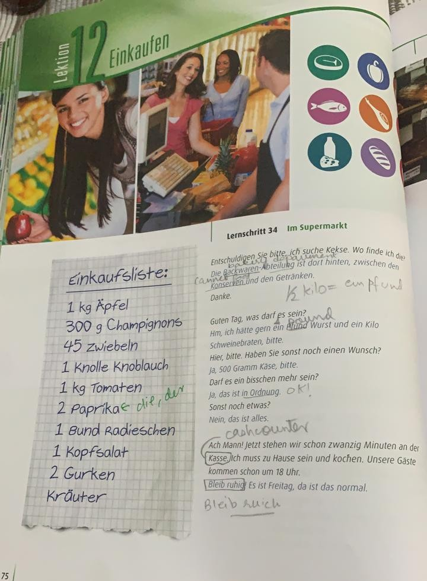
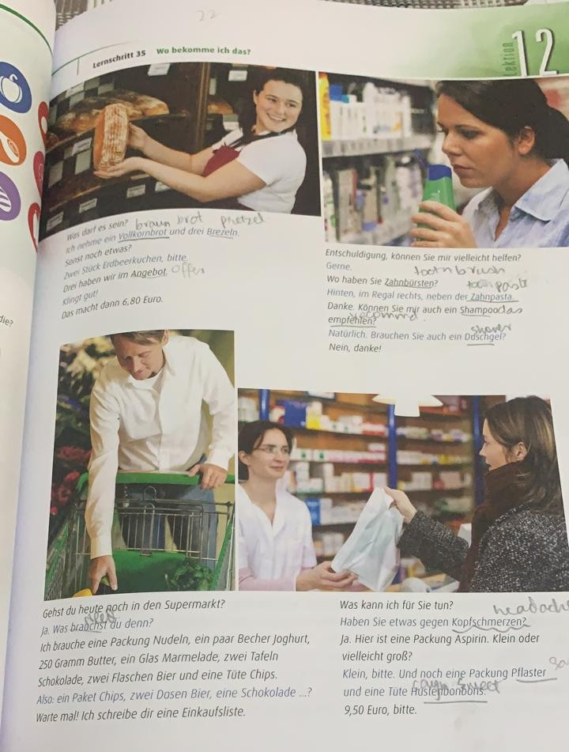

# Lecture 10 - 17.03.2021 : Lebensmittel Gesch&auml;ft

noun:
Geschäft is singular
Geschäfte is plural

verb:
einkaufen -> to shop

|Deutsch|English|
|:---:|:---:|
|Ich m&ouml;chte ein termin f&uuml;r einkaufen.|I want an appointment for shopping.|
|Ich m&ouml;chte ein termin f&uuml;r Arzt. (male)| I want an appointment for doctor.|
|Ich m&ouml;chte ein termin f&uuml;r &Auml;rzte. (female)|I want an appointment for doctor.|

aussprache:
f&uuml;r --> foya

Radieschen -> Radish -> Laal muli

Kopfsalat -> green karwa salad

Gurken -> cucumber

Krauter -> basil, mint/Minze, corriander/korriander, parsley/Petersilie

bund -> bunch

<blockquote>
mostly we dont use gender of vegetables, we always count them.
most vegetables are female though, all plurals are femal anyway.
</blockquote>

Kekse -> biscuits

dort -> right there

darf /  -> D&uuml;rfen (modal very) / means "allowed"

hatte -> would have

Wunsch -> wish

sonst -> else

sonst etwas -> anything else

gern -> to like

ein bisschen - > a little

mehr -> more

Ordnung -> Ok

hinten -> hinten

Die Backwaren -> backery

Die Abteilung -> department

department is also a word in German

Teil -> Part

zwischen -> between

Abteilung / department
<blockquote>
all words ending in `ung` is a feminine, always!!!
</blockquote>

#### Abteilung / department

|Deutsch|English|
|:---:|:---:|
|Backwaren|Bakery|
|Getranken|Drinks|
|Konservew|Canned Items|
|Fleisch|Chicken, Meat|
|Gewurtz|Spices|
|S&uuml;ssigkeit (pronounce as zuzishkeit)|Sweats|
|Gesicht|Face wash, shampoo, conditioner, etc|
|Milch Produkt|milk, K&auml;se/cheese, jogurt, butter, fresh yeast, sahne, cooking cream / Kochensahne|
|Gewurtz|Spices|

Chicken / H&auml;hnchen (male) - H&uuml;hnchen(femle),  Rind / Beaf, kalb / calb. Schwein / pig meat, Fisch / Fish

Powder / Pulver, baking powder / Backpulver, baking papper / Backpapier, salt / salz, pepper / peffer, haldi / kurkuma

Suss -> Suß

Suss -> Sweats

Sie ist eine suss Person. / She is a sweat person

Sie ist eine sch&ouml;n Person. / She is a nice person

sp&uuml;lung / conditioner

Deine gesicht ist sehr sch&ouml;n. -> Your face is very pretty.

Kochen / to cook, Die Kuchen / cake, K&uuml;che / Kitchen

## Homework:
> make two sentences each with these modal verbs
* muchten / to want
* konnnen / can
