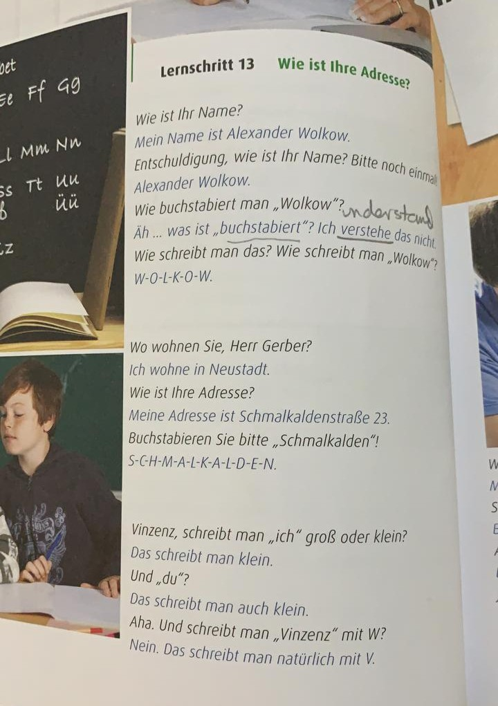
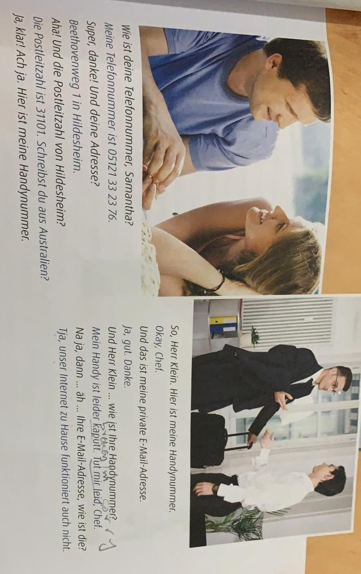
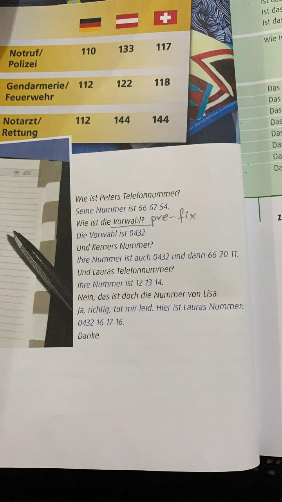

noch einmal - > once again

buchstabiert -> to spell

&Auml;h -> Ohh!

verstehen -> to understand

auch -> also

schreiben -> to write

nat&uuml; -> naturally, obviousuly

Postleitzahl -> postal code

leider -> unfortunately

kaputt -> broken

Tut mir leid -> I am sorry

Tut mir sehr leid -> I am very sorry

Chef -> boss, supervisor

Na ja! dont agree or disagree

dann -> then

Tja -> apologetic

unser -> will study later, personnel pronomen

Ach so! -> okay I understand

## homework - read next page

