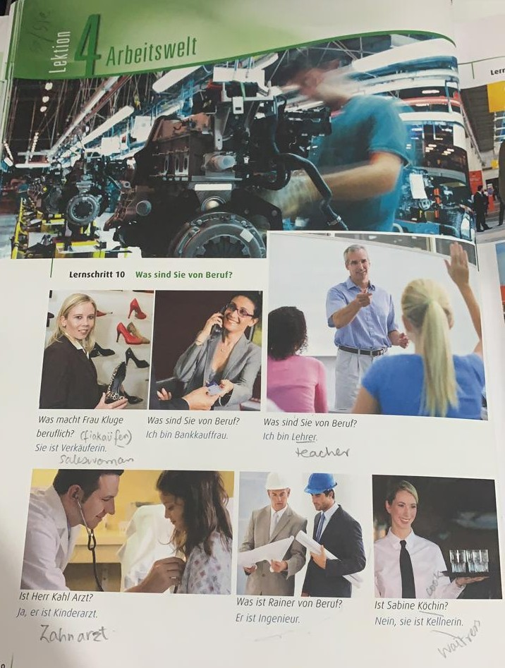
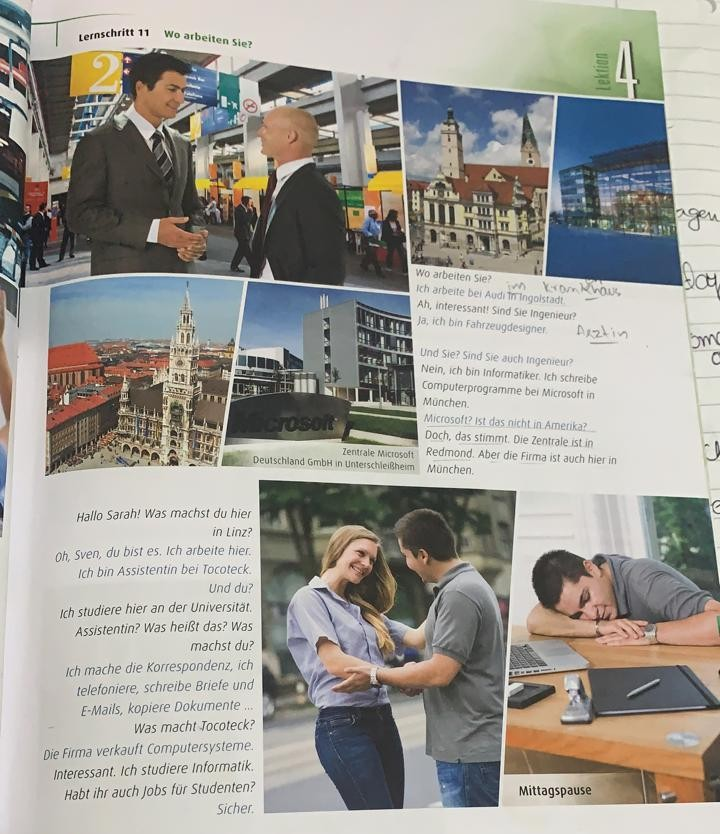

# Beruf - Occupation

| English|Deutsch|Ich|du|er / sie /es|wir|ihr|Sie(formal)sie(plural)|
|--- |--- |--- |--- |--- |--- |--- |--- |
|work|arbeiten|arbeite|arbeitest|arbeitet|arbeiten|arbeitet|arbeiten|

|English|Deutsch|
|--- |--- |
|What is your occupation?||
|I work as a software engineer.|Ich bin Software Engineer von beruf.|
|I work at AAI GmbH.|Ich arbeite bei AAI GmbH.|

Prepositions

* von = from
* bis = to
* bei = at

|English|Deutsch|
|--- |--- |
|Was sind Sie von Beruf?|What are their professions?|
|verka&uuml;fer|salesman|
|verka&uuml;ferin|saleswoman|
|Bankkauffrau|Banker woman|
|Bankkaufmann|Banker man|
|Beruflich (adjective)|Professional|
|Lehger|Teacher male|
|Lehgerin|Teacher female|
|Arzt|doctor male|
|Kinderarzt|child doctor female|
|Arzt|doctor male|
|Kinderarzt|child doctor male|
|Facharzt|specialist doctor male|
|Fach&auml;rztin|specialist doctor female|
|Ingenieur|engineer male|
|Ingenieurin|engineer female|
|Koch|chef male|
|K&ouml;chin|chef female|
|Kellner|waiter female|
|Kellnerin|waiteress|

## Trennbaren Verbs - Seperable Verbs

|English|Deutsch|
|--- |--- |
|to sell|verkaufen|
|to buy|einkaufen|

Ich kaufe lebensmittel ein.

Ich mochte ein auto einkaufen. 

abholung = ab + holung

kochen / kuchen --> to cook, cake

|English|Deutsch|
|--- |--- |
|vehicle designer|fahrzrrugdesigner|

fahhrad / bicycle
reisen nach / travel to

I want to travel to Turkey. Ich mochte nach Turkei zu reisen.

Doch / sure, although (give alternate without negating)
aber / But
stimmt / right (correct)

du bist es. it is you, ohh tummm!

Sicher / Sure

sein (bist), arbeiten, machen
sein (bin), studieren (study)m heissen, telefoniert (to call someone, infinitive form, exception)
shcreiben, kopiert (to copy, infinitive form, exception)
verkaufen (to sell), haben

ausnahme / exception

dort ist, there is
wo ist, where is
was ist, what is
wer ist, who is

Was sind Sie von Beruf? (formal)

Was bist du von Beruf? (informal)

What do you do?

Wo arbeiten Sie / arbeitest du?

Ich arbeite zu Hause.

I work at home.

arbeitslos -> unemployed

selbstst&auml;ndig -> self-employed / freelancer

Rentner -> pensioner / retired

Doch -> 

!!! image from whatsapp
