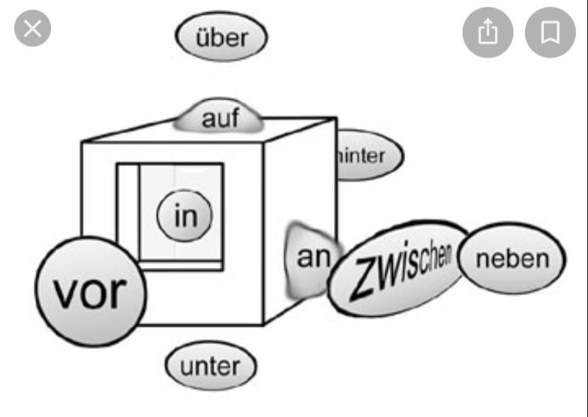
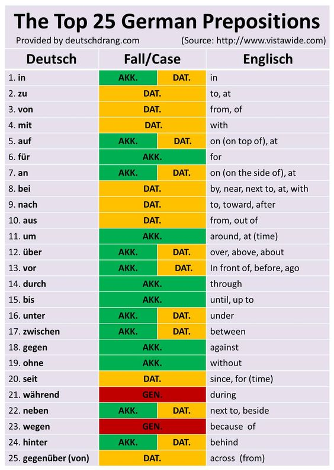

# Lecture 17

Noch ein mal bitte?

One more time please?

||Nominativ|Akkusativ|
|---|---|---|
|M|der / ein|den / einen|
|F|die / eine|die / eine|
|N|das / ein|das / ein|

    90% nouns are Akkusativ

## Dativ

    always has a preposition with verb

    if sentence has 2 nouns: 1st is always akkusative, 2nd is always nominative or dativ

    subject is always nominative, only objects can be akkusativ/nominative/dativ

|||
|---|---|
|M|dem|einem|
|F|der|einer|
|N|dem|einem|

|English|Deutsch|
|---|---|
|The girl is drinking water in a bottle|Ein M&auml;dchen ist trinkt wasser in der Flasche|
|The fork is on the table|Eine/Die gabel ist auf der Tische|

## Prepositions

* an - on the side of / besides
* auf - on top of
* in - in
* neben - near / next to
* unter / below
* &uuml;ber / above
* vor - infront
* zeischen - between
* hinter - behind

|English|Deutsch|
|---|---|
|I put the umbrella on the door.|Ich leige den Regenschirm auf der t&uuml;r|
||Der Teppisch leigt auf dem boden|

## HOMEWORk: make two sentences - with preposition + noun + verb

|English|Deutsch|
|---|---|
|I put the laptop on the sofa.|Ich leige den Laptop auf dem Sofa.|
|I put the icecream in the fridge.|Ich leige das Eis im (in+dem) Kühlschrank.|

im = in dem

ins = in das

## Further Practice:
