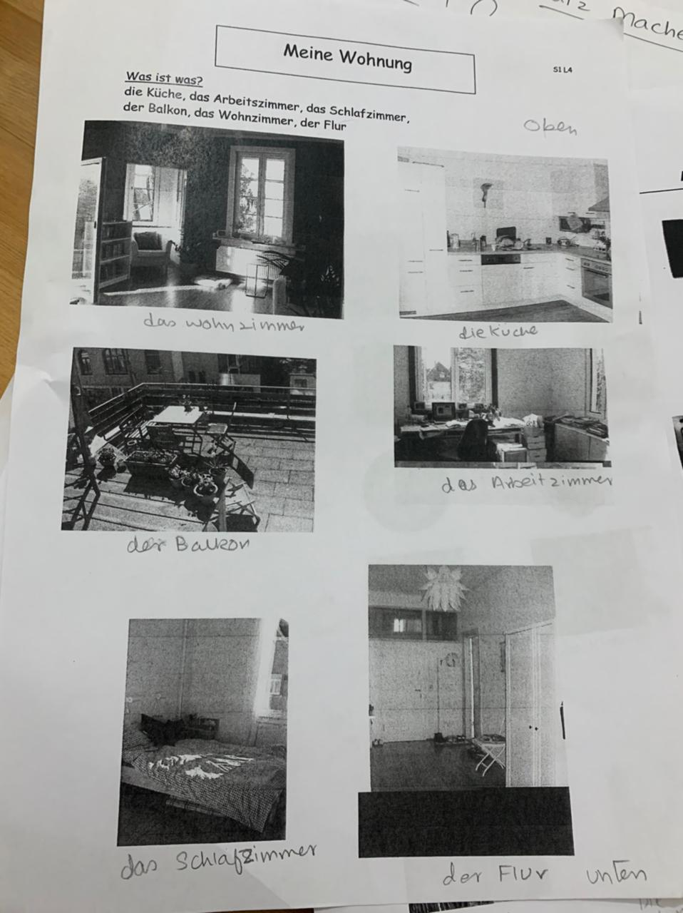
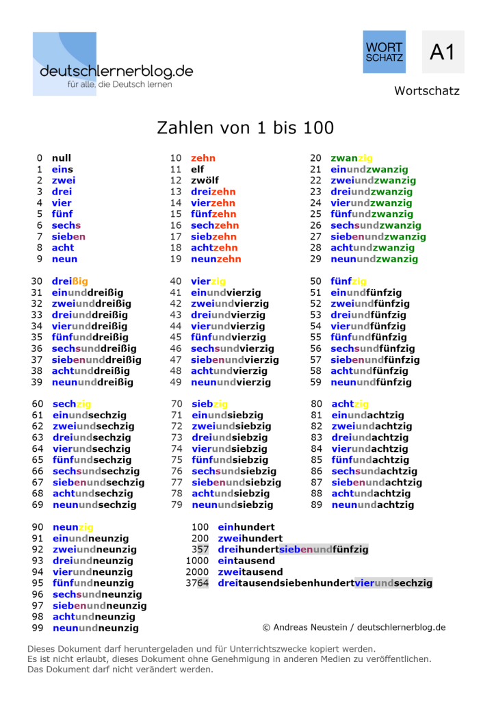
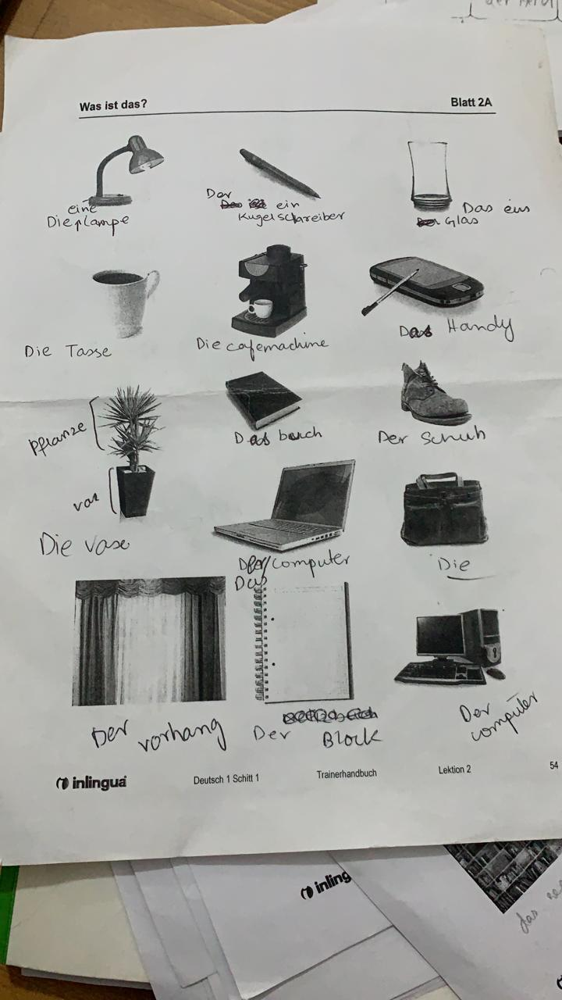

# Lecture 4 – 25.02.2021 : Sentence Making – Satz Machen

## Sentence structure

Subject + verb + object

|||English|Deutsch|
|--- |--- |--- |--- |
|I|Ich|I drink coffee.|Ich trinke kaffee.|
|You|du|You drink coffee.|Du trinkst kaffee.|
|He / she/ it|er / sie/ es|He/she/it drinks coffee.|Er/sie/es trinkt kaffee.|
|We|Wir|We drink coffee.|wir trinken kaffee.|
|Third person (informal) (2-3 ppl.)|ihr|You drink coffee.|Ihr trinkt kaffee.|
|Third person (formal)|Sie(formal)|(formal) They drink coffee.|Sie trinken kaffee.|
|Third person (informal)|sie(plural)|(informal) They drink coffee.|sie trinken kaffee.|

## German Numerics

> \+ plus (urdu pronunciation: plus as in bus in german)
>
> \- minus (urdu pronunciation: meenus)
>
> \* mal (urdu pronunciation: maal)
>
> / durch
>
> = ist gleich

### Example Usage:

All people are equal. Alle leute sind gleich.

All men are equal. Alle manner sind gleich.

Men are equal to men. Manner under Frauen sind gleich.

With mit

Without ohne

Kaese Cheese

das Kuche kitchen, das wohnzimmer living room, der Flur the lobby, Meine
wohnung my apartment, der Balkon the balcony, das arbeitzimmer the work
room, das Schlafzimme, the sleeping room

1818 eintausendacthundertachtzehn

2772 zweitausendseibenhundertzweiundseibzig

9999 neuntausendneunhundertneunundneunz

Lehrer Male teacher

Lehrerin Female teacher

**Homework:**
=============

> 1 - Answer plus and minus questions?
>
> 2 – Learn Verb
