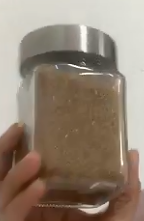
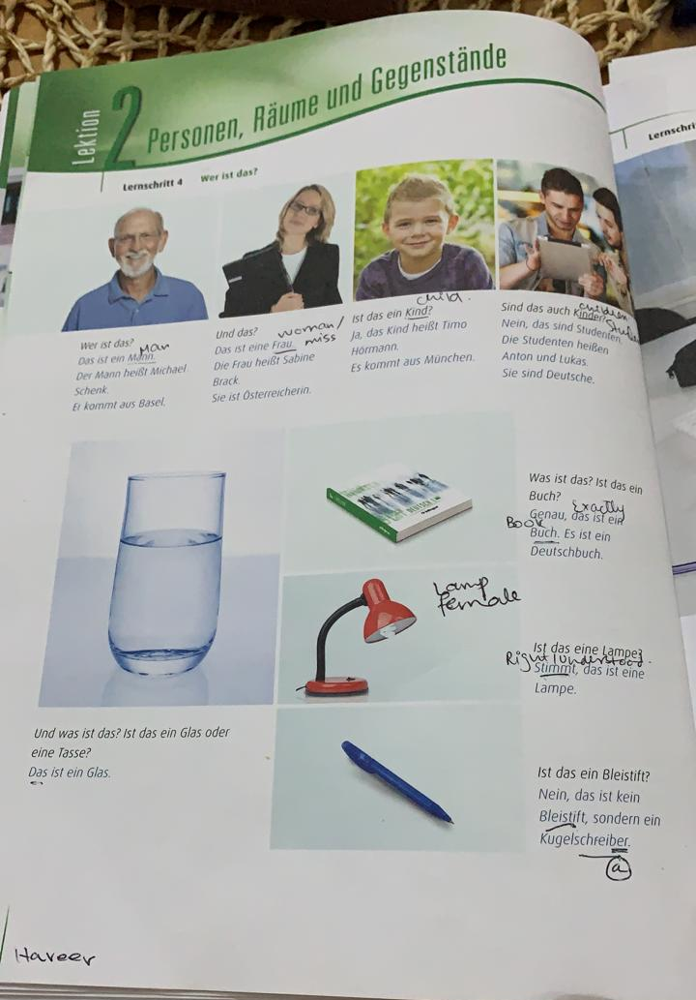
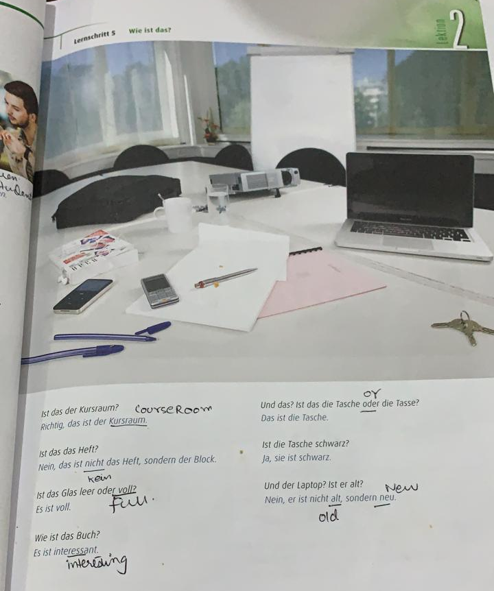
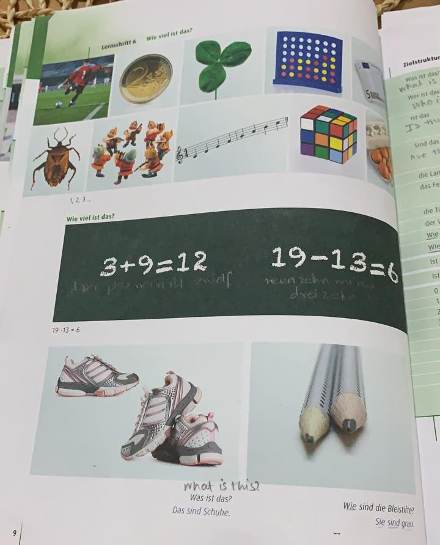
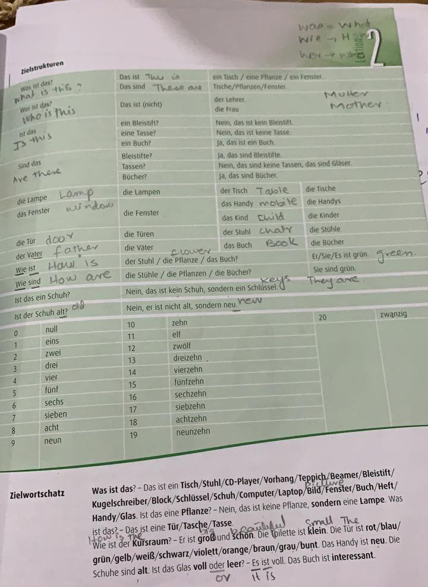

# Lecture 6 – 04.03.2021

**Greetings**

aufwedersehen see you later

aufwederhören talk to you later

|Bistimmt Artikel – Definite|Unbistimmt Artikel – Indefinte|
|--- |--- |
|der – masculine|ein|
|die – faminine|eine|
|das – neutral|ein|

das ist **eine** tasche (nominative)

> there are four forms of verb in Deutsch. will study later.

1.  Das ist **ein** (r)Kuli.

2.  Das ist **ein** (s)papier.

3.  Das ist **ein** (r)Mann.

4.  Das ist **ein** (s)Kind.

5.  Das ist **eine** (e)Tasse.

Das sind Kinder. They are children. (advanced)

||This is sugar in the bottle. Das sind **zucker** im die **flache**.|
|---|---|

(direct) (indirect)

-   only use articles for direct objects, not with indirect objects.

The book is on the table. Das ist ein buch am der Tisch.

This is a measuring tape, it is on the table. das ist ein \_\_\_
(direct) am der Tisch(indirect).

The book is in the bag on the table. Das Buch liegt in der Tasche auf
dem Tisch.

## Homework: read four pages from Hira.

sondern instead (balkay), leer empty, voll full, heft notebook(register)

schwarz black

how are these pencils? they are grey.

